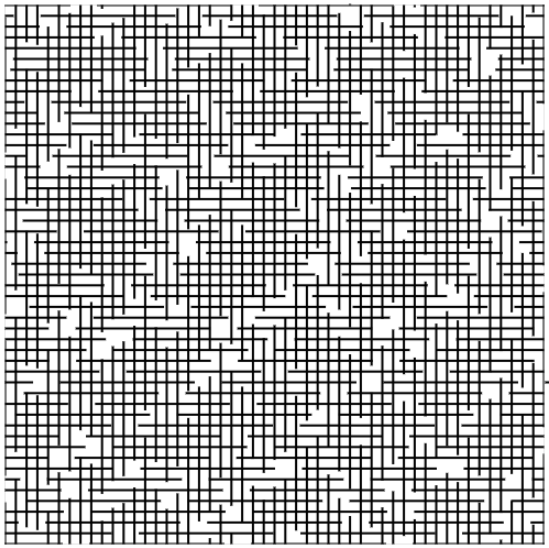
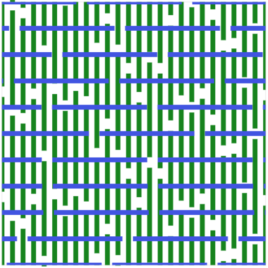
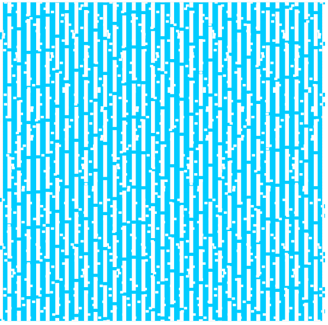
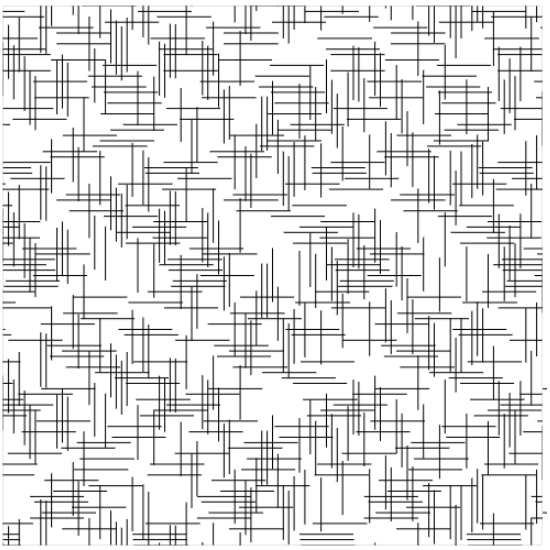
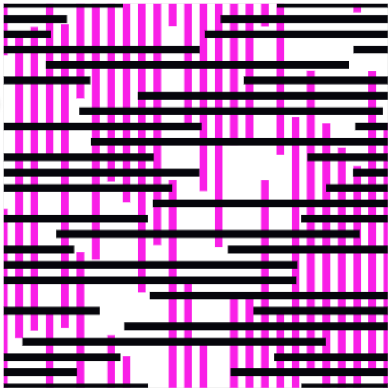
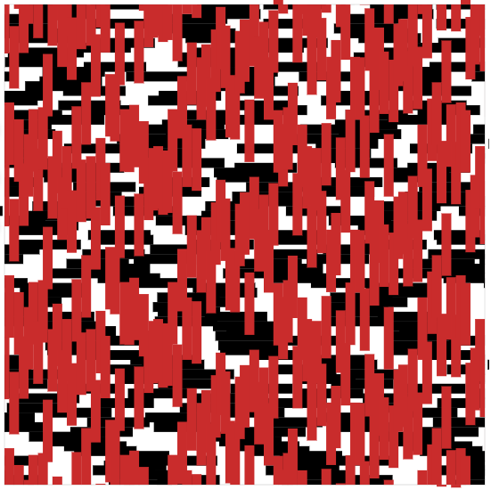
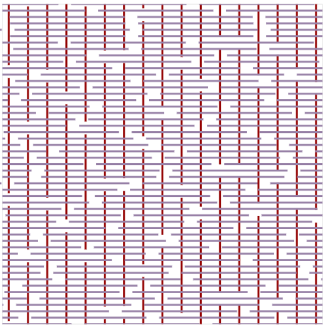

# Locations of Lines
Interactive generative line art creator using Numpy and Bokeh. Inspired by artwork by Sol LeWitt.

# Examples of interactive plotting

# How to use
1. Clone repo.

2. Make sure you have Numpy and Bokeh installed.

3. Open terminal.

4. cd to directory with locations_of_lines.py

5. bokeh serve --show locations_of_lines.py

# Examples of plots

